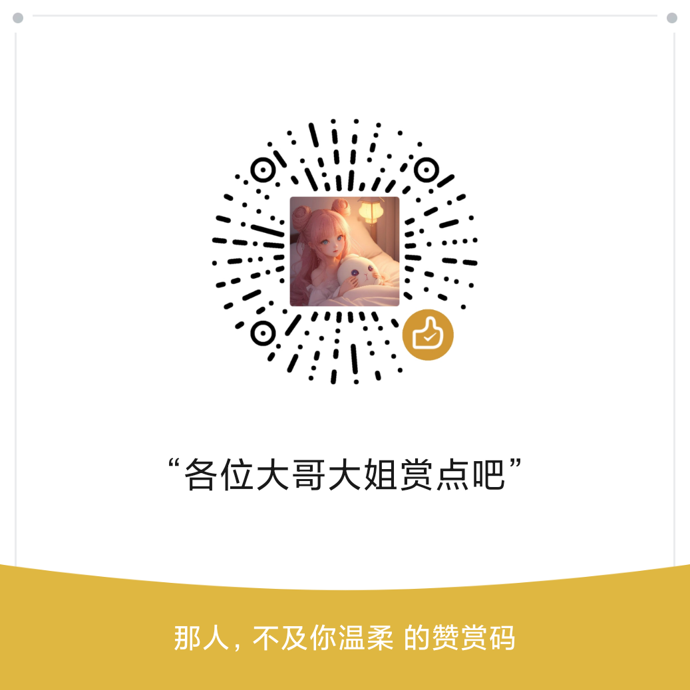

[;无情祝您今天愉快!&center=true&size=27)](https://git.io/typing-svg)

<picture>
  <source media="(prefers-color-scheme: dark)" srcset="./assets/images/coding.gif" />
  <source media="(prefers-color-scheme: light)" srcset="./assets/images/developer.svg" height="225px" />
  
</picture>

&nbsp;

  &emsp;
  <!-- visitor -->
  &emsp;

<picture>
  <source media="(prefers-color-scheme: dark)" srcset="./profile-snake-contrib/github-contribution-grid-snake-dark.svg" />
  <source media="(prefers-color-scheme: light)" srcset="./profile-snake-contrib/github-contribution-grid-snake.svg" />
  
</picture>

#  🙋 Hello

<table>

<tr><td>

### 🤺 About Me

&emsp;&emsp;嗨，你好，我是无情。热爱编程、摄影、读书、旅行。

&emsp;&emsp;热爱计算机科学和 IT 互联网事业，希望能成为一名优秀的开发者。

&emsp;&emsp;我们正在让这个世界变得更加美好，通过代码的重复使用和延展构建完美体系。

&emsp;&emsp;<strong>We're making the world a better place. Through constructing elegant hierarchies for maximum code reuse and extensibility.</strong>

</tr></td>

<tr><td>

### 📃 Recent Blog

<!-- feed start -->
- Jan 01 - [2025 → 2026，给时光以生命，待岁月以温柔！](https://blog.guoqi.dev/posts/2025/)
- Mar 18 - [昆仑巢「疯狂星期六」，没有人是一座孤岛～](https://blog.guoqi.dev/posts/kun-lun-chao/)
- Mar 10 - [你好，北京！你好，原则科技！](https://blog.guoqi.dev/posts/yuan-ze-ke-ji/)
- Feb 20 - [行则将至，未来可期，和 2023 好好说声再见吧！](https://blog.guoqi.dev/posts/2023/)
- Feb 16 - [西藏之旅｜青春没有售价，火车直达拉萨！](https://blog.guoqi.dev/posts/xi-zang/)
<!-- feed end -->

</td></tr>

<!-- <tr><td>

### 📊 WakaTime

<picture>
  <source
    srcset="https://github-readme-stats.vercel.app/api/wakatime?username=Ruthlessa&layout=compact&text_color=f0f6fc&bg_color=00000000&hide_border=true&hide_title=true"
    media="(prefers-color-scheme: dark)"
  />
  <source
    srcset="https://github-readme-stats.vercel.app/api/wakatime?username=Ruthlessa&layout=compact&text_color=1f2328&bg_color=00000000&hide_border=true&hide_title=true"
    media="(prefers-color-scheme: light)"
  />
  
</picture>

</td></tr> -->

</table>

  <picture>
    <source media="(prefers-color-scheme: dark)" srcset="https://readme-jokes.vercel.app/api?hideBorder&bgColor=%23121212" />
    <source media="(prefers-color-scheme: light)" srcset="https://readme-jokes.vercel.app/api?hideBorder&bgColor=%ffffff" />
    
  </picture>

<picture>
  <source media="(prefers-color-scheme: dark)" srcset="https://github-readme-streak-stats.herokuapp.com/?user=Ruthlessa&theme=dark&hide_border=true" />
  <source media="(prefers-color-scheme: light)" srcset="https://github-readme-streak-stats.herokuapp.com/?user=Ruthlessa&theme=light&hide_border=true" />
  
</picture>

<table>
  <tr>
    <td>
      <picture>
        <source media="(prefers-color-scheme: dark)" srcset="https://github-readme-activity-graph.vercel.app/graph?username=Ruthlessa&theme=xcode&bg_color=FF000000&hide_border=true" />
        <source media="(prefers-color-scheme: light)" srcset="https://github-readme-activity-graph.vercel.app/graph?username=Ruthlessa&theme=xcode&bg_color=FF000000&color=000000&hide_border=true" />
        
      </picture>
  </tr>
</table>

 

<!-- 
 
 -->

 

<!-- svg -->

 

 

<!-- gif -->

<picture>
  <source media="(prefers-color-scheme: dark)" srcset="./profile-3d-contrib/profile-night-rainbow.svg" />
  <source media="(prefers-color-scheme: light)" srcset="./profile-3d-contrib/profile-gitblock.svg" />
  
</picture>

## 💖 赞助支持 / Sponsor Me

如果我的项目和内容对您有帮助，欢迎通过以下方式支持我！每一份鼓励都是我持续创作的动力 ❤️

If my work has helped you, consider supporting me through the options below. Your generosity keeps me going! ❤️

&nbsp;

<!-- 赞助按钮组 -->

  <!-- GitHub Sponsors 官方按钮 -->
  &emsp;
  <!-- Buy Me a Coffee 按钮 -->
  

&nbsp;

<!-- 赞助徽章 -->

  &emsp;
  &emsp;
  

&nbsp;

<!-- 扫码赞助：PayPal 二维码 + 微信赞赏码 -->
<table>
  <tr>
    <td align="center" width="320">
      

         
        

          <strong style="color: #003087; font-size: 16px;">🌐 PayPal（海外）</strong> 
          扫码或访问 paypal.me/ruthlessa
        

      

    </td>
    <td width="40"></td>
    <td align="center" width="320">
      

         
        

          <strong style="color: #07c160; font-size: 16px;">💚 微信赞赏码（国内）</strong> 
          微信扫描二维码打赏支持
        

      

    </td>
  </tr>
</table>

<table>
  <tr>
    <td></td>
    <td></td>
  </tr>
  <tr>
    <td></td>
    <td></td>
  </tr>
  <tr>
    <td></td>
    <td></td>
  </tr>
  <tr>
    <td></td>
    <td></td>
  </tr>
  <tr>
    <td></td>
    <td></td>
  </tr>
</table>

